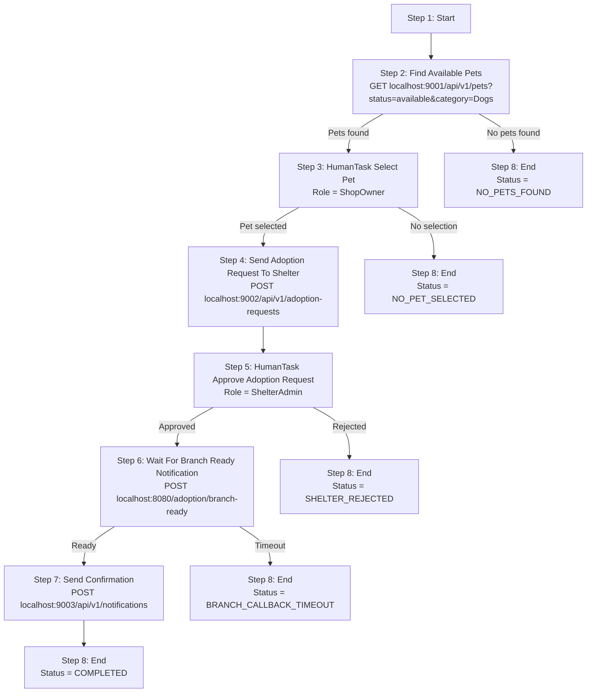

# Adopt Pet Workflow

## Overview

This workspace contains a Ballerina mock service for a pet adoption workflow demo.

The demo now models two human decisions explicitly:

- `ShopOwner` selects the pet from the search results
- `ShelterAdmin` approves the adoption request and creates the adoption order

This document describes the workflow as 8 steps:

1. Start
2. Find Available Pets
3. HumanTask Select Pet
4. Send Adoption Request To Shelter
5. HumanTask Approve Adoption Request
6. Wait For Branch Ready Notification
7. Send Confirmation
8. End

## Demo Flow



## Step 1: Start

- Type: workflow start
- URL: Not applicable
- Purpose: accept workflow input and initialize the run

### Workflow Input JSON

```json
{
  "requestId": "req-2026-06-24-001",
  "preferredCategory": "Dogs",
  "pickupPreference": "weekend"
}
```

## Step 2: Find Available Pets

- Service: `localhost:9001`
- Method: `GET`
- URL: `/api/v1/pets?status={preferredStatus}&category={preferredCategory}`
- Purpose: search pets by workflow input filters

### Input JSON

No input JSON. This step uses query parameters from workflow input.

### Request

```http
GET /api/v1/pets?status=available&category=Dogs
```

### Service Response JSON

```json
{
  "preferredStatus": "available",
  "preferredCategory": "Dogs",
  "petsFound": 2,
  "results": [
    {
      "id": 2001,
      "name": "Luna",
      "status": "available",
      "category": "Dogs",
      "price": 125.50
    },
    {
      "id": 2002,
      "name": "Milo",
      "status": "available",
      "category": "Dogs",
      "price": 99.99
    }
  ]
}
```

## Step 3: Select Pet By Owner (HumanTask)

- Type: HumanTask
- Role: `ShopOwner`
- Purpose: select the pet that should be sent for adoption approval

This step is manual for the demo.

- The workflow receives the filtered results from step 2
- The `ShopOwner` selects one dog
- After selection, the workflow continues to step 4

### HumanTask Input JSON

```json
{
  "preferredStatus": "available",
  "preferredCategory": "Dogs",
  "petsFound": 2,
  "results": [
    {
      "id": 2001,
      "name": "Luna",
      "status": "available",
      "category": "Dogs",
      "price": 125.50
    },
    {
      "id": 2002,
      "name": "Milo",
      "status": "available",
      "category": "Dogs",
      "price": 99.99
    }
  ]
}
```

### HumanTask Completion JSON

```json
{
  "selectedPetId": 2001,
  "selectedPetName": "Luna",
}
```

## Step 4: Approve Adoption Request (HumanTask)

- Type: HumanTask
- URL: Not applicable
- Role: `ShelterAdmin`
- Purpose: approve or reject the shelter request and create the adoption order if approved

### HumanTask Input JSON

```json
{
  "requestId": "req-2026-06-24-001",
  "petId": 2001,
  "petName": "Luna",
  "pickupPreference": "weekend"
}
```

### HumanTask Completion JSON

```json
{
  "approved": true,
  "orderId": 91001,
  "comment": "some text"
}
```

## Step 5: Send Adoption Request To Shelter

- Service: `localhost:9002`
- Method: `POST`
- URL: `/api/v1/adoption-requests`
- Purpose: submit the selected pet for shelter review

### Request JSON

```json
{
  "orderId": "91001",
  "referenceID" : "workflowID",
  "selectedPetId": 2001,
  "selectedPetName": "Luna",
  "pickupPreference": "weekend"
}
```

### Service Response JSON 201


## Step 6: Wait For Branch Ready Notification

- Method: `POST`
- URL: `http://localhost:8080/adoption/branch-ready`
- Purpose: wait until the downstream system signals that the adoption order is ready at the branch
- Default workflow callback URL: `http://localhost:8080/adoption/branch-ready`
- Default delay: `30` seconds
- Both values are configurable in `Config.toml`

During the wait, the mock service prints a countdown in the logs before sending the callback request.

### Incoming JSON

```json
{
  "eventType": "adoption.order.branch.ready",
  "referenceID": "workflowID",
  "orderId": 91001,
  "requestId": "req-2026-06-24-001",
  "petId": 2001,
  "petName": "Luna",
  "status": "READY_FOR_PICKUP",
}
```


## Step 7: Send Confirmation

- Service: `localhost:9003`
- Method: `POST`
- URL: `http://localhost:9003/api/v1/notifications`
- Purpose: notify the customer that the adoption order is ready

### Request JSON

```json
{
  "requestId": "req-2026-06-24-001",
  "orderId": 91001,
  "petName": "Luna",
  "branchName": "Central Shelter Branch",
  "readyAt": "2026-06-27T14:00:00Z",
  "message": "Your adoption order is approved and ready for pickup."
}
```

### Service Response JSON

```json
{
  "id": "notif-3001",
  "delivered": true
}
```


## Step 8: End


### Workflow Result JSON

```json
{
  "status": "COMPLETED",
  "requestId": "req-2026-06-24-001",
  "orderId": 91001,
  "petName": "Luna",
  "confirmationId": "notif-3001",
  "delivered": true
}
```

## Configuration

The service reads these values from `Config.toml`:

```toml
workflowCallbackUrl = "http://localhost:8080/adoption/branch-ready"
confirmationDelaySeconds = 30
```

## Running The Mock

```bash
bal run
```

## Demo Notes

- The workflow is assumed to be running on port `8080`.
- The callback URL can point to any workflow endpoint that accepts the branch-ready JSON.
- Query-parameter-only steps do not have input JSON in this document.
