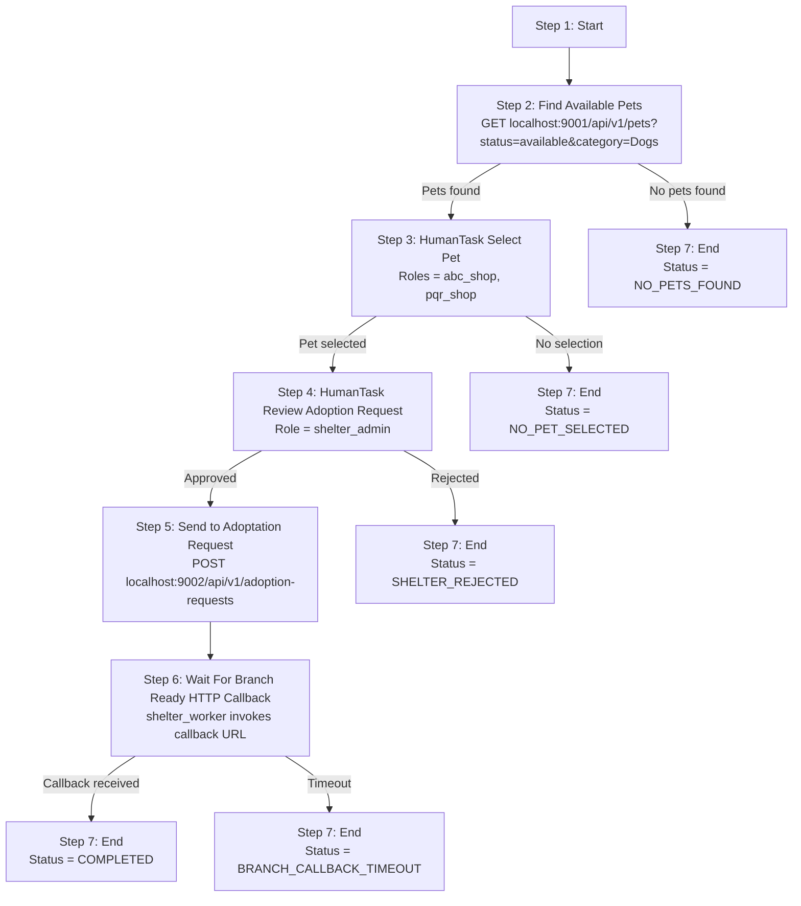

# Adopt Pet Workflow

## Overview

This workspace contains a Ballerina mock service for a pet adoption workflow demo,
plus a React task portal under [`app/`](./app) for driving the human tasks.

The demo models work across **two personas** (no role overlap between them):

| Persona | Roles | Responsibility |
|---|---|---|
| **Shop** | `abc_shop`, `pqr_shop` | Select the pet from the search results (Step 3) |
| **Shelter** | `shelter_admin` | Approve the adoption request and create the order (Step 5) |
| **Shelter** | `shelter_worker` | Invoke the branch-ready **HTTP callback** when the order is ready (Step 6) |

The [task portal](./app) renders a **different mode per persona**: Shop users
*initiate* adoptions and complete the Select-Pet task; Shelter `shelter_admin`
users approve requests **and** get an Admin-Console view of every adoption's
status. The workflow learns who initiated a run from the input (see Step 1).

This document describes the workflow as 7 steps:

1. Start
2. Find Available Pets
3. HumanTask: Select Pet (by the Shop)
4. HumanTask: Review Adoption Request (by the Shelter)
5. Send to Adoptation Request 
6. Wait For Branch Ready HTTP Callback
7. End

## Demo Flow



## Step 1: Start

- Type: workflow start
- URL: Not applicable
- Purpose: accept workflow input and initialize the run

The workflow input **must carry who is initiating the run**. The task portal
fills `initiatedBy` and `initiatorRole` automatically from the signed-in Shop
user. The workflow uses `initiatorRole` to scope the Step 3 Select-Pet human
task to that shop's role, so `abc_shop` runs are picked by ABC shop users and
`pqr_shop` runs by PQR shop users.

### Workflow Input JSON

```json
{
  "requestId": "req-2026-06-24-001",
  "preferredCategory": "Dogs",
  "pickupPreference": "weekend",
  "initiatedBy": "owner@abc-shop.com",
  "initiatorRole": "abc_shop"
}
```

> `initiatedBy` / `initiatorRole` are injected by the App — a caller may
> override them by supplying their own values in the input.

### Type Definitions

Defined in `adoptpetworkflow/types.bal`:

```ballerina
public type WorkflowInput record {|
    string requestId;
    string preferredCategory;
    string pickupPreference;
    string initiatedBy;
    string initiatorRole;
|};

// Workflow data record — holds the Step 6 callback future
type AdoptPerWorkflowData record {|
    future<BookingCallback> BookingDetails;
|};
```

## Step 2: Find Available Pets

- Service: `localhost:9001`
- Method: `GET`
- URL: `/api/v1/pets?status={preferredStatus}&category={preferredCategory}`
- Purpose: search pets by workflow input filters

### Input JSON

No input JSON. This step uses query parameters from workflow input.

### Request

```http
GET /api/v1/pets?status=available&category=Dogs
```

### Service Response JSON

```json
{
  "preferredStatus": "available",
  "preferredCategory": "Dogs",
  "petsFound": 2,
  "results": [
    {
      "id": 2001,
      "name": "Luna",
      "status": "available",
      "category": "Dogs",
      "price": 125.50
    },
    {
      "id": 2002,
      "name": "Milo",
      "status": "available",
      "category": "Dogs",
      "price": 99.99
    }
  ]
}
```

### Type Definitions

Workflow-side view (`adoptpetworkflow/types.bal`):

```ballerina
public type PetSearchResult record {|
    string preferredStatus;
    string preferredCategory;
    int petsFound;
    Results results;
|};

public type Results ResultsItem[];

public type ResultsItem record {|
    int id;
    string name;
    string status;
    string category;
    decimal price;
|};
```

Mock service contract (`backend/main.bal`):

```ballerina
type PetSearchResponse record {|
    string preferredStatus;
    string? preferredCategory;
    int petsFound;
    Pet[] results;
|};

type Pet record {|
    int id;
    string name;
    string status;
    string category;
    decimal price;
|};
```

## Step 3: Select Pet By Shop (HumanTask)

- Type: HumanTask
- Role: the **initiating shop's** role — `initiatorRole` from Step 1 (`abc_shop` or `pqr_shop`)
- Purpose: select the pet that should be sent for adoption approval

This step is manual for the demo.

- The workflow receives the filtered results from step 2
- The task is assigned to `initiatorRole`, so only users of the shop that
  started the run (e.g. `abc_shop`) can select the pet
- After selection, the workflow continues to step 4

### HumanTask Input JSON

```json
{
  "preferredStatus": "available",
  "preferredCategory": "Dogs",
  "petsFound": 2,
  "results": [
    {
      "id": 2001,
      "name": "Luna",
      "status": "available",
      "category": "Dogs",
      "price": 125.50
    },
    {
      "id": 2002,
      "name": "Milo",
      "status": "available",
      "category": "Dogs",
      "price": 99.99
    }
  ]
}
```

### HumanTask Completion JSON

```json
{
  "selectedPetId": 2001,
  "selectedPetName": "Luna",
}
```

### Type Definitions

Defined in `adoptpetworkflow/types.bal`. The HumanTask **payload (input)** is
`PetSearchResult` (see Step 2); the **completion (output)** is:

```ballerina
public type SelectPetResponse record {|
    int selectedPetId;
    string selectedPetName;
|};
```

## Step 4: Adoption Request (HumanTask)

- Type: HumanTask
- URL: Not applicable
- Role: `shelter_admin` (the **Shelter** persona)
- Purpose: approve or reject the shelter request and create the adoption order if approved

### HumanTask Input JSON

```json
{
  "requestId": "req-2026-06-24-001",
  "petId": 2001,
  "petName": "Luna",
  "pickupPreference": "weekend"
}
```

### HumanTask Completion JSON

```json
{
  "approved": true,
  "orderId": 91001,
  "comment": "some text"
}
```

### Type Definitions

Defined in `adoptpetworkflow/types.bal`:

```ballerina
// HumanTask payload (input)
public type ShelterAdminReview record {|
    string requestId;
    int petId;
    string petName;
    string pickupPreference;
|};

// HumanTask completion (output)
public type ShelterAdmin record {|
    boolean approved;
    int orderId;
    string comment;
|};
```

## Step 5: Send Adoption Request To Shelter

- Service: `localhost:9002`
- Method: `POST`
- URL: `/api/v1/adoption-requests`
- Purpose: submit the selected pet for shelter review

### Request JSON

```json
{
  "requestId": "91001",
  "callbackId" : "workflowID",
  "selectedPetId": 2001,
  "selectedPetName": "Luna",
  "pickupPreference": "weekend"
}
```

### Service Response JSON 201

### Type Definitions

Mock service contract (`backend/main.bal`):

```ballerina
type SubmitAdoptionRequest record {|
    string requestId;
    string callbackId;
    int selectedPetId;
    string selectedPetName;
    string pickupPreference;
    string? callbackUrl;
    int? confirmationDelaySeconds;
|};

type AdoptionRequestAccepted record {|
    int status;
|};
```

## Step 6: Wait For Branch Ready HTTP Callback

- Type: HTTP callback
- Actor: `shelter_worker` (the **Shelter** persona) invokes the callback endpoint
- Purpose: send branch-ready JSON so the workflow can resume
- Default delay before instruction is printed: `30` seconds (configurable in `Config.toml`)

The mock branch service (`localhost:9002`) prints a ready-to-run `curl` command
to its console after accepting the adoption request. The shelter worker runs that
command to post the payload to the callback URL and resume the workflow.

Callback payload JSON:

### Callback Payload JSON

```json
{
  "eventType": "adoption.order.branch.ready",
  "referenceID": "workflowID",
  "requestId": "req-2026-06-24-001",
  "petId": 2001,
  "petName": "Luna",
  "status": "READY_FOR_PICKUP"
}
```

Example callback invocation:

```bash
curl -X POST 'http://localhost:9080/workflow/Bookings/{workflowId}' \
  -H 'Content-Type: application/json' \
  -d '{"eventType":"adoption.order.branch.ready","referenceID":"workflowID","requestId":"req-2026-06-24-001","petId":2001,"petName":"Luna","status":"READY_FOR_PICKUP"}'
```

### Callback HTTP Service

The callback is served by a **custom Ballerina HTTP service** in the
`adoptpetworkflow` package (not the workflow management API). Posting the
branch-ready payload calls `workflow:sendData(..., "BookingDetails", ...)`,
which resolves the `future<BookingCallback> BookingDetails` field in
`AdoptPerWorkflowData` and resumes the run.

| Field | Value |
|---|---|
| Host | `http://localhost:9080/workflow` |
| Method | `POST` |
| Path | `/Bookings/{workflowId}` |
| Request body type | `BookingCallback` |
| Effect | Resolves `data.BookingDetails`, resuming Step 6 |

`{workflowId}` is the workflow run ID (the `callbackId` sent in Step 5 /
`ctx.getWorkflowId()`). The listen port is configurable via
`callbackServicePort` (default `9080`).

### Type Definitions

Workflow future resolved by the callback (`adoptpetworkflow/types.bal`):

```ballerina
public type BookingCallback record {|
    string eventType;
    string referenceID;
    string requestId;
    int petId;
    string petName;
    string status;
|};
```

Payload the mock prints for the worker to POST (`backend/main.bal`):

```ballerina
type BranchReadyNotification record {|
    string eventType;
    string referenceID;
    string requestId;
    int petId;
    string petName;
    string status;
|};
```

## Step 7: End


### Workflow Result JSON

```json
{
  "eventType": "adoption.order.branch.ready",
  "referenceID": "workflowID",
  "requestId": "req-2026-06-24-001",
  "petId": 2001,
  "petName": "Luna",
  "status": "READY_FOR_PICKUP"
}
```

### Type Definitions

The workflow returns the `BookingCallback` value resolved at Step 6 (see Step 6
Type Definitions), defined in `adoptpetworkflow/types.bal`.

## Configuration

The service reads these values from `Config.toml`:

```toml
confirmationDelaySeconds = 30
```

The `adoptpetworkflow` package exposes the Step 6 callback HTTP service; its
port is configurable (default `9080`):

```toml
callbackServicePort = 9080
```

## Running The Mock

```bash
cd backend
bal run
```

## Running The Task Portal (UI)

The React portal under [`app/`](./app) lets you list and complete the human
tasks as the different Shop / Shelter users. The workflow Management API is
assumed at `http://localhost:8234/workflow`.

```bash
cd app
npm install
npm run dev      # http://localhost:3100  (proxies /workflow → :8234)
```

See [`app/README.md`](./app/README.md) for details.

## Demo Notes

- The workflow runtime / Management API is assumed on port `8234`.
- Step 6 is resolved by the custom Ballerina callback HTTP service in
  `adoptpetworkflow` (`POST /workflow/Bookings/{workflowId}`, default port
  `9080`) — run the `curl` command printed by the backend.
- Query-parameter-only steps do not have input JSON in this document.
